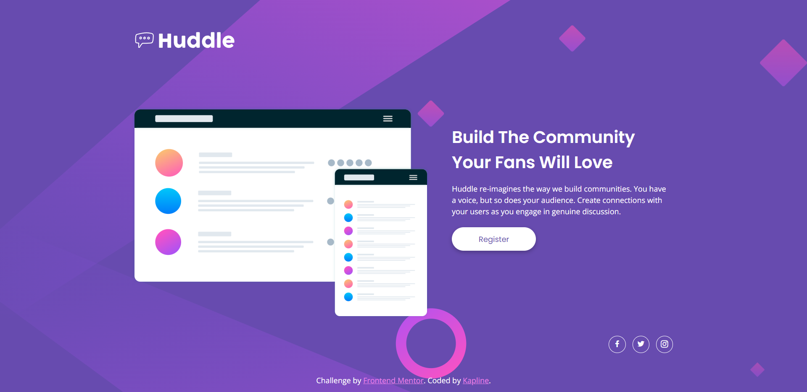

# Frontend Mentor - Huddle landing page with single introductory section solution

This is a solution to the [Huddle landing page with single introductory section challenge on Frontend Mentor](https://www.frontendmentor.io/challenges/huddle-landing-page-with-a-single-introductory-section-B_2Wvxgi0). Frontend Mentor challenges help you improve your coding skills by building realistic projects. 

## Table of contents

- [Overview](#overview)
  - [The challenge](#the-challenge)
  - [Screenshot](#screenshot)
  - [Links](#links)
- [My process](#my-process)
  - [Built with](#built-with)
  - [What I learned](#what-i-learned)
  - [Continued development](#continued-development)
  - [Useful resources](#useful-resources)
- [Author](#author)

## Overview

### The challenge

Users should be able to:

- View the optimal layout for the page depending on their device's screen size
- See hover states for all interactive elements on the page

### Screenshot

### Links

- [Solution URL](https://www.frontendmentor.io/solutions/responsive-landing-page-using-flexbox-cuaDW1Snle)
- [Live site URL](http://kapline.me/huddle-landing-page-with-single-introductory-section-master/)

## My process

### Built with

- Semantic HTML5 markup
- CSS custom properties
- Flexbox
- GitHub Pages
- Font Awesome

### What I learned

I have added icons in this project using Font Awesome. This is my first time ever using this sort of tool.

### Continued development

Next I want to focus on JavaScript learning. Make projects with only HTML and CSS was fun, but I need to go further.

### Useful resources

- [How to add icons via Font Awesome](https://fontawesome.com/docs/web/add-icons/how-to) - Used this guideline to add icons to this project

## Author

- Frontend Mentor - [@TrueKapline](https://www.frontendmentor.io/profile/TrueKapline)
